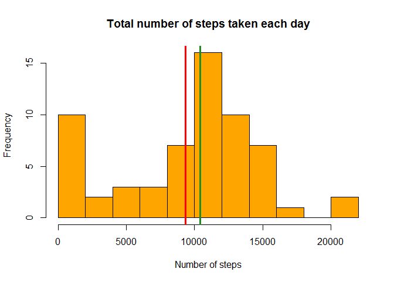
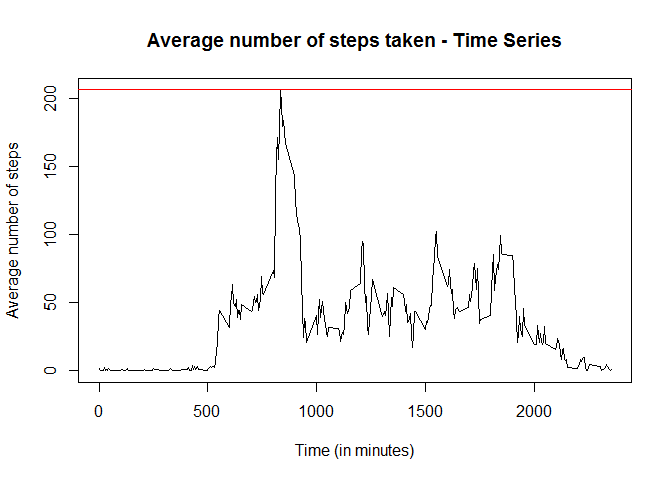
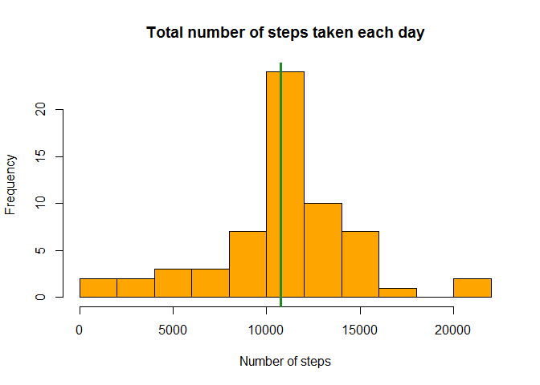

# Reproducible Research: Peer Assessment 1


## Loading and preprocessing the data


```r
library(dplyr)
```

```
## 
## Attaching package: 'dplyr'
```

```
## The following objects are masked from 'package:stats':
## 
##     filter, lag
```

```
## The following objects are masked from 'package:base':
## 
##     intersect, setdiff, setequal, union
```

```r
dataset <- read.csv("activity.csv")
```


## What is mean total number of steps taken per day?

At first I calculate the total number of steps taken per day and save the result in a new variable called ```steps_per_date```.


```r
steps_per_date <- dataset %>% group_by(date) %>% summarise(steps = sum(steps, na.rm = TRUE))
```

Then I plot a histogram of the total number of steps taken each day. Here, I added a vertical red line at the mean and a vertical green line at the median value.


```r
hist(steps_per_date$steps, main = "Total number of steps taken each day",
     xlab = "Number of steps", col = "orange", breaks = 10)
abline(v = mean(steps_per_date$steps), col = "red", lwd = 3)
abline(v = median(steps_per_date$steps), col = "forestgreen", lwd = 3)
```

<!-- -->

The mean and the median of the total number of steps taken per day are:


```r
mean(steps_per_date$steps)
```

```
## [1] 9354.23
```

```r
median(steps_per_date$steps)
```

```
## [1] 10395
```

## What is the average daily activity pattern?

At first, I calculate the average number of steps taken, averaged across all days.


```r
avg_steps_per_interval <- dataset %>% 
  group_by(interval) %>% summarise(avg_steps = mean(steps, na.rm = TRUE))
```

Then I make a time series plot of the 5-minute interval (x-axis) and the average number of steps taken, averaged across all days (y-axis).  
Here, I added a horizontal line at the maximum number of steps.


```r
plot(avg_steps_per_interval, type = "l", 
     main = "Average number of steps taken - Time Series",
     xlab = "Time (in minutes)", ylab = "Average number of steps")
abline(h = max(avg_steps_per_interval$avg_steps), col = "red", lwd = 1)
```

<!-- -->

The interval which contains the maximum number of steps, on average across all the days in the dataset, is calculated as follows.


```r
with(avg_steps_per_interval, interval[avg_steps == max(avg_steps)])
```

```
## [1] 835
```


## Imputing missing values

Let's calculate and report the total number of missing values in the dataset.


```r
sum(is.na(dataset))
```

```
## [1] 2304
```

In the following code I have created a new dataset ```dataset_cpy``` that is equal to the original dataset but with the missing data filled in. The NA values were replaced by the mean for that 5-minute interval, across all the days.


```r
dataset_cpy <- dataset
for(interval in unique(dataset_cpy$interval)){
  dataset_cpy$steps[is.na(dataset_cpy$steps) & dataset_cpy$interval == interval] <- 
    avg_steps_per_interval$avg_steps[avg_steps_per_interval$interval == interval]
}
```

I now make a second histogram of the total number of steps taken each day, using the new dataset.


```r
steps_per_date_2 <- dataset_cpy %>% group_by(date) %>% summarise(steps = sum(steps, na.rm = TRUE))

hist(steps_per_date_2$steps, main = "Total number of steps taken each day",
     xlab = "Number of steps", col = "orange", breaks = 10)
abline(v = mean(steps_per_date_2$steps), col = "red", lwd = 3)
abline(v = median(steps_per_date_2$steps), col = "forestgreen", lwd = 3)
```

<!-- -->

The mean and the median of the total number of steps taken per day, calculated with the new dataset, are:


```r
mean(steps_per_date_2$steps)
```

```
## [1] 10766.19
```

```r
median(steps_per_date_2$steps)
```

```
## [1] 10766.19
```

We can observe that, by imputing missing data, the mean and the median number of steps taken each day have now the same value.


## Are there differences in activity patterns between weekdays and weekends?

At first, I have created a new factor variable in the dataset with two levels -- "weekday" and "weekend" indicating whether a given date is a weekday or weekend day. Then I calculated the average number of steps taken and stored it in a new variable ```avg_steps_per_int_day```


```r
library(lubridate)
```

```
## Warning: package 'lubridate' was built under R version 3.3.2
```

```
## 
## Attaching package: 'lubridate'
```

```
## The following object is masked from 'package:base':
## 
##     date
```

```r
dataset_cpy$day_type[weekdays(ymd(dataset_cpy$date)) %in% c("Saturday", "Sunday")] <- "weekend"
dataset_cpy$day_type[!(weekdays(ymd(dataset_cpy$date)) %in% c("Saturday", "Sunday"))] <- "weekday"
dataset_cpy$day_type <- as.factor(dataset_cpy$day_type)

avg_steps_per_int_day <- dataset_cpy %>% 
  group_by(interval, day_type) %>% summarise(avg_steps = mean(steps))
```

Finally, using the lattice plotting system, I have made a panel plot containing a time series plot (i.e. type = "l") of the 5-minute interval (x-axis) and the average number of steps taken, averaged across all weekday days or weekend days (y-axis).


```r
library(lattice)
```

```
## Warning: package 'lattice' was built under R version 3.3.2
```

```r
with(avg_steps_per_int_day, xyplot(avg_steps ~ interval | day_type, type = "l", 
       ylab="Number of steps", xlab="Interval", layout = c(1, 2)))
```

<!-- -->


